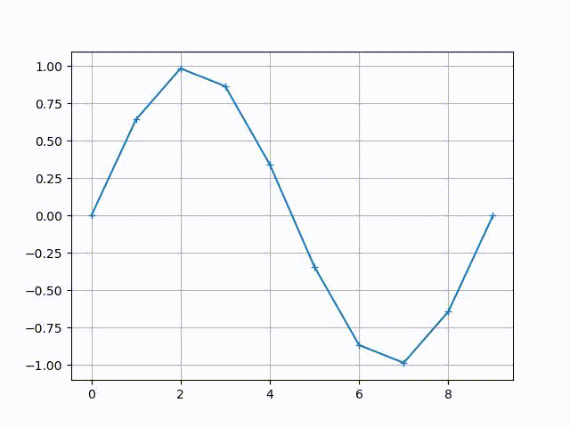
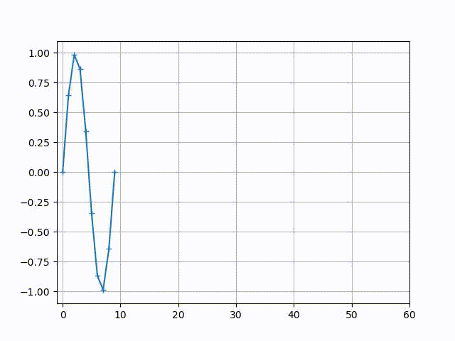

# Chat GPT Examples

Like everyone else in the world, I've been looking at how ChatGPT can both simplify my coding life and help me communicate coding concepts more qickly to my colleagues.  I'll post examples here as they seem relevant to communicating a point.

# N-Agent "follow the leader" control law.
The [nbody_example.py](nbody_example.py) Python program simulates N-body dynamics using a pairwise virtual force law based on velocity dampening, transverse velocity dampening, and a directed version of Hooke's law. This control law is designed to simulate a group of agents, where the lead agent (Nth agent) follows a prescribed path, and the other agents follow along using a virtual force law between each successive pair of agents.  

The initial prompt used to generate this code is as follows, as well as in the source file:
<blockquote>
Generate a stubbed out python program using numpy. Include function definitions, but not the internal code that implements the functions.  Instead just return 0.  The program should include a full main call using the "if __name__ == __main__" construction, and the main program should be complete.  
  
The purpose of this program is to simulates N-body dynamics using the following pairwise force laws for pairwise spring, transverse velocity dampening, and velocity dampening:
  
  &nbsp;&nbsp;&nbsp;fpw(x,y) = espilon_x_y * b * (norm(x-y) - D) * (y-x)/norm(x-y).  
  &nbsp;&nbsp;&nbsp;ftv(x,y,vx) = - gamma_t * ( vx - dot(vx, (y-x)/norm(y-x))*(y-x)/norm(y-x) )
  &nbsp;&nbsp;&nbsp;fvd(vx) = - gamma * vx

The variables x, y, and vx are vectors.  The variables gamma, gamma_t, b and D are scalars that are the same for all pairs of particles. The variable 
epsilon_x_y is a scalar variable that masks whether or not x should be influenced through a force from y.  The variables x and y represent the 
positions of particles, and the variable vx represents the velocity of the particle with position x.  

For coding conventions, make sure to use function definitions where it makes reading the code most efficient.  Also make sure to include a main 
function.  Document the code clearly and thoroughly.
</blockquote>

The interaction dynamics of the agents are described by a virtualized Newton's laws of motion, which relate the control acting on an object to its acceleration. In this case, we implement this concept using a virtual force to simulate the interaction between the agents. The virtual force acting on an agent is determined by the relative positions and velocities of the agents.

The virtual force law is forward-looking in the sense that the connectivity graph does not have loops. This is because loops can lead to feedback oscillations. To prevent this, we use a directed virtual Hooke's law.

The main function of the example program uses the three force calculation functions to simulate the positions and velocities of a set of particles. The program initializes the positions and velocities of 10 particles and runs the simulation for a given number of time steps, updating the positions and velocities at each step based on the forces acting on the particles.

The program uses the NumPy library to perform vectorized calculations, which allows for faster and more efficient computation. The code is structured using function definitions and clear documentation to improve readability and maintainability. The program also includes an if statement to allow it to be imported as a module or run as a standalone script.

# Proportional Navigation for the   N-Agent "follow the leader" control law.
In the [nbody_pronav_example.py](nbody_pronav_example.py) program, we modify the virtual force law used in the previous example to use **proportional navigation**. Proportional navigation is a guidance law commonly used in missile intercept systems. The guidance law is based on the principle of parallel navigation, which states that an interceptor must fly a path that is parallel to the path of the target, but with a time delay.

In our case, we use proportional navigation to position each agent into a specified relative position behind the agent they are following. If an agent with coordinates **x** is following an agent with coordinates **y** and velocity **vy**, then the virtual position that agent **x** attempts to achieve at that moment is **y - D * vy/norm(vy)**, where **D** is the intended follow distance.

The main function of the example program is similar to the previous example, but incorporating the proportional navigation virtual force law in place of the virtualized Hooke's Law. The program initializes the positions and velocities of 10 particles and runs the simulation for a given number of time steps, updating the positions and velocities at each step based on the forces acting on the particles.

